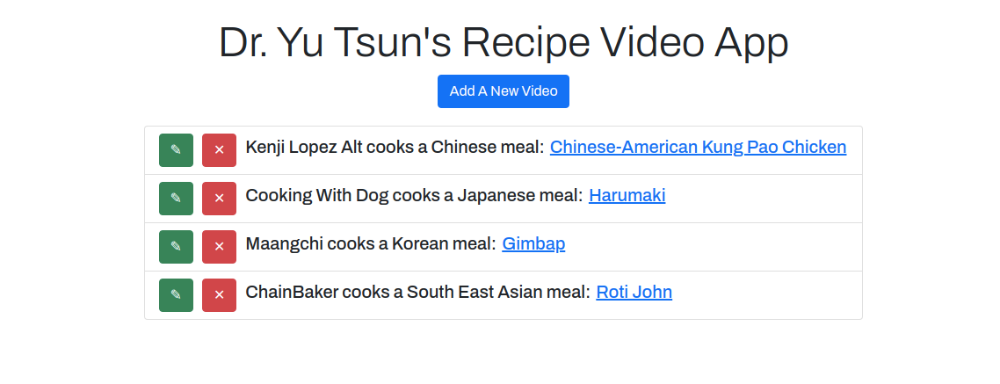

# Dr. Yu Tsun's Favorite Cooking Videos App

## About The App:
This CRUD app is designed to make it easy to keep track of your favorite cooking videos on youtube.

## Tech Stack:
This project utilizes, express, express-ejs-layouts and bootstrap.

## MVP Goals:
- [x] Bulletproof, Rudimentary CRUD functionality.
- [x] Bootstrap Styling on top of EJS templates in order to make it more aesthetically pleasing.

## Stretch Goals:
- [ ] Create a Custom CSS Stylesheet, Improve Styling, improved per Route Styles?
- [ ] Separate Router Logic from Controller Logic
- [ ] Learn how to use checkbox in order to push boolean values into JSON.

